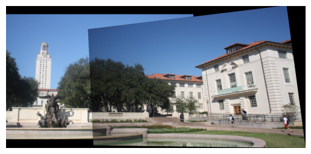

# Image Stitching with Harris and SIFT

This repository demonstrates an image stitching pipeline using Harris corner detection, SIFT descriptors, feature matching, RANSAC-based homography estimation, and image warping. The project was originally developed as part of a computer vision course assignment.

## Techniques Used

- Harris corner detection
- SIFT descriptor extraction
- Feature matching using brute-force and KNN
- Homography estimation via RANSAC
- Image warping and compositing
- Multi-image stitching

## Example Output

| Input Images | Stitched Panorama |
|--------------|------------------|
|   |  |

Additional results including multi-image stitching can be found in the notebook.

## Files

- `HW3_stitching.ipynb`: Main Jupyter notebook with the stitching pipeline implementation.
- `data/`: Contains example input and output images used for testing and demonstration.

## Installation

Install the required dependencies using pip:

```bash
pip install -r requirements.txt
